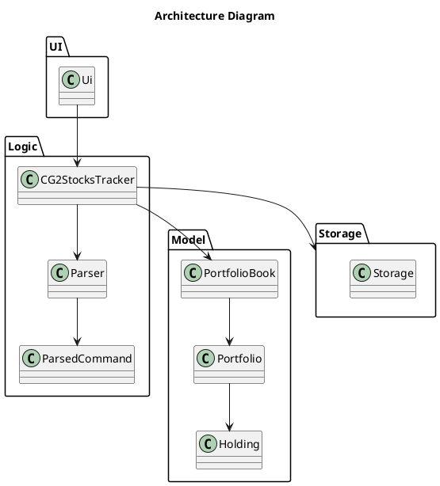
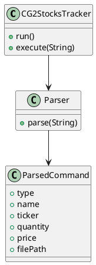

# Developer Guide

## Acknowledgements

{list here sources of all reused/adapted ideas, code, documentation, and third-party libraries -- include links to the original source as well}

## Design & implementation


# Developer Guide


## Design

### Architecture

The Architecture Diagram above gives an overview of the main components in the application and how they interact.

The application consists of four main components:

- **UI**: Handles user input and output

- **Logic**: Executes commands

- **Model**: Stores application data in memory

- **Storage**: Reads and writes data to disk


The `CG2StocksTracker` class acts as the main entry point of the application. It is responsible for initializing these components and coordinating the execution of commands.

---

### How the components interact

When a user enters a command, the flow is as follows:

1. The command is read by `Ui`

2. The command string is passed to `CG2StocksTracker`

3. `Parser` parses the command and returns a `ParsedCommand`

4. `CG2StocksTracker` executes the command using the Model

5. If the command modifies data, `Storage` saves the updated state

6. The result is returned to `Ui` for display


---

### Architecture Diagram



---

## UI Component

### Overview

The API of this component is specified in `Ui.java`.

The `Ui` component is responsible for interacting with the user. It reads input commands and displays results or error messages.

---

### How the UI works

- `Ui` reads user input as a string

- It forwards the input to `CG2StocksTracker`

- It displays the output returned by the application


The UI does not perform any parsing or business logic.

---

## Logic Component

### Overview

The command parsing subsystem is responsible for translating raw user input strings into structured, type-safe command objects that the rest of the application can act upon. It is composed of three tightly related classes: `CommandType`, `ParsedCommand`, and `Parser`. Together, they form a clean separation between the *syntax* of a command (what the user typed), the *semantics* of a command (what it means), and the *dispatch* of a command (what should happen).

---

### Architecture-Level Description

At the architecture level, the parsing subsystem sits between the user interface layer and the application logic layer. The main application loop in `CG2StocksTracker` reads a raw string from `Ui`, hands it to `Parser`, and receives back a `ParsedCommand`. The application then switches on the `CommandType` contained within that `ParsedCommand` to decide which handler to invoke.

This design keeps the application loop simple: it never inspects raw strings itself, and it never needs to know how options are encoded. All of that knowledge is encapsulated in `Parser`.

---

### Component-Level Description

#### `CommandType` — The Command Vocabulary

`CommandType` is a Java `enum` that enumerates every command the application understands:

```
CREATE, USE, LIST, ADD, REMOVE, SET, SET_MANY, VALUE, HELP, EXIT
```

Its role is to serve as the single authoritative list of valid commands. Using an enum instead of raw strings eliminates
an entire class of bugs: a typo like `"CREAT"` is caught at compile time rather than causing a silent mismatch at 
runtime. It also makes exhaustive `switch` statements possible — the compiler can warn if a new `CommandType` value is 
added but not handled.

**Design decision:** The enum is kept intentionally minimal — it carries no behaviour, no labels, and no metadata. This 
keeps the command vocabulary cleanly decoupled from parsing logic and from execution logic. An alternative considered 
was storing a display name or usage string inside the enum. This was rejected because it would mix concerns; usage 
strings belong in `Ui`.

---

#### `ParsedCommand` — The Data Transfer Object

`ParsedCommand` is a Java `record` that carries all the information the application needs to execute a command:

```java
public record ParsedCommand(
    CommandType type,
    String name,
    AssetType assetType,
    String ticker,
    Double quantity,
    Double price,
    String listTarget,
    Path filePath
)
```

Records in Java are implicitly immutable and generate `equals`, `hashCode`, and `toString` automatically. This makes 
`ParsedCommand` safe to pass around without defensive copying.

Not every field is populated for every command. For example, a `VALUE` command needs no fields beyond `type`, while an 
`ADD` command needs `assetType`, `ticker`, and `quantity`. Fields that are not applicable for a given command are simply
`null`.

**Design decision:** A single record with nullable fields was chosen over a class hierarchy (e.g. a `CreateCommand 
extends ParsedCommand` pattern). The hierarchy approach would have been more type-safe in principle, but for a CLI 
application of this scale, the added boilerplate outweighs the benefit. The flat record is simpler to construct, simpler
to test, and straightforward to extend when new commands are added.

**Alternative considered:** Using `Optional<T>` instead of nullable fields. This was considered to make the "may be 
absent" contract explicit, but Java records with `Optional` fields carry more syntactic overhead at construction sites 
(e.g., `Optional.of(...)`, `Optional.empty()`) which clutters the `Parser` code without adding meaningful safety at this
scale.

---

#### `Parser` — The Core Logic

`Parser` is a stateless class with a single public entry point:

```java
public ParsedCommand parse(String input) throws AppException
```

Internally, parsing proceeds in two stages: **tokenisation** and **command-specific parsing**.

##### Stage 1: Tokenisation

The `tokenise` method splits the input string on whitespace, with support for double-quoted tokens. This allows 
arguments containing spaces (such as a portfolio name like `"My Portfolio"`) to be passed as a single token.

The tokeniser iterates character by character, tracking an `inQuotes` boolean flag. When the flag is active, whitespace 
is treated as a regular character rather than a delimiter. An unclosed quote is detected at the end of the loop and 
raises an `AppException`.

For example, the input `/add --type stock --ticker "BRK A" --qty 10` produces the token list `["/add", "--type", 
"stock", "--ticker", "BRK A", "--qty", "10"]`.

**Design decision:** A hand-written character-by-character tokeniser was used rather than `String.split()` or a regular 
expression, because neither handles quoted tokens natively without significant complexity. A proper lexer library was 
not used because the grammar is simple enough that the overhead of a dependency is not justified.

##### Stage 2: Command-Specific Parsing

After tokenisation, the first token (the command word, e.g. `/add`) is extracted and matched using a `switch` 
expression. Each `case` delegates to a dedicated private method:

```java
return switch (commandWord) {
    case "create" -> parseCreate(tokens);
    case "add"    -> parseAdd(tokens);
    case "set"    -> parseSet(tokens);
    // ...
};
```

Commands that accept named options (e.g. `--type`, `--ticker`, `--qty`) go through `parseOptions`, which reads tokens in
key-value pairs and populates a `Map<String, String>`. The helper `requireOption` then asserts that a required key is 
present, throwing a descriptive `AppException` if it is missing.

Two additional helpers enforce type safety: `parsePositiveDouble` parses a string to a `double` and asserts it is 
strictly positive (used for `--qty` and `--price`), while `normaliseTicker` uppercases the ticker string so that `aapl` 
and `AAPL` are treated identically regardless of how the user typed them.

---

### Sequence Diagram: Parsing a `/add` Command

The following sequence diagram illustrates what happens when the user types `/add --type stock --ticker AAPL --qty 10`.

<!-- INSERT SEQUENCE DIAGRAM 1 HERE -->

---

### Sequence Diagram: Handling an Invalid Command

The following shows what happens when the user enters a malformed command, such as `/add --type stock` (missing 
`--ticker` and `--qty`). The `AppException` thrown by `requireOption` propagates back to `CG2StocksTracker.run()`, which
catches it and routes it to `Ui.showError()`. This ensures that all user-facing errors are displayed consistently 
regardless of which stage of parsing failed.

<!-- INSERT SEQUENCE DIAGRAM 2 HERE -->

---

### Error Handling Strategy

All parsing errors are reported via `AppException`, a checked application-specific exception. This was a deliberate 
choice over using unchecked exceptions: callers are forced by the compiler to handle or propagate the exception, making 
it impossible to accidentally swallow a parse error. The messages in `AppException` are written in plain English and 
include usage hints (e.g., `"Usage: /add --type TYPE --ticker TICKER --qty QTY"`), making them suitable for direct 
display to the user.

---

### Alternatives Considered

| Design Choice | Chosen Approach | Alternative | Reason for Choice |
|---|---|---|---|
| Command representation | `enum CommandType` | String constants | Compile-time safety, exhaustive switch |
| Parsed data container | Java `record` (flat) | Class hierarchy per command type | Simpler code, adequate for scale |
| Optional fields | Nullable fields | `Optional<T>` fields | Less construction-site boilerplate |
| Tokenisation | Hand-written char loop | `String.split` / regex | Handles quoted tokens naturally |
| Error signalling | Checked `AppException` | Unchecked `RuntimeException` | Forces callers to handle errors |

---

### Summary

The parsing subsystem deliberately keeps each class narrowly focused. `CommandType` is the vocabulary. `ParsedCommand` 
is the data carrier. `Parser` is the translation logic. No class bleeds into the other's responsibility. This separation
means that adding a new command in the future requires only: adding a value to `CommandType`, adding a `case` to 
`Parser.parse()` with a corresponding `parseX()` method, and adding a handler in `CG2StocksTracker.execute()`. No other 
files need to change.

### Class Diagram



---

### Design considerations

The application uses a single `ParsedCommand` class instead of separate command classes.

This approach was chosen because:

- It keeps the number of classes small

- It simplifies the parsing process


However, it means that adding new commands requires modifying existing code instead of adding new classes.

---


## Model Component

### Overview

The Model component stores all application data in memory.

It consists of:

- `PortfolioBook`: manages multiple portfolios

- `Portfolio`: manages holdings within a portfolio

- `Holding`: represents a single asset


---

### How the Model works

- `PortfolioBook` stores all portfolios and tracks the active portfolio

- `Portfolio` stores holdings using an internal collection

- `Holding` stores ticker, quantity, and price


---

### Class Diagram


---

### Design considerations

The Model does not depend on UI or Storage.

This ensures that:

- Business logic is kept separate

- The Model can be tested independently

- Changes to UI or Storage do not affect the Model


---

## Storage Component

### Overview

The API of this component is specified in `Storage.java`.

The Storage component is responsible for:

- Saving application data to disk

- Loading data from disk

- Processing CSV files for bulk updates


---

### How the Storage component works

- `save(...)` writes the current state to file

- `load(...)` reads data during application startup

- `loadPriceUpdates(...)` processes CSV input


---

### Design considerations

CSV processing is implemented in `Storage` instead of `Parser` because:

- It involves file handling

- It is not part of command parsing


---

# Implementation

---

## Command execution

This section describes how commands are executed in the application.

---

### Sequence Diagram


---

### Explanation

This diagram shows the general flow for all commands.

The important points are:

- All commands go through `CG2StocksTracker`

- Parsing is handled separately by `Parser`

- The Model performs the actual operation

- Storage is only involved when data changes


---

## Create portfolio

### Implementation

The `create` command creates a new portfolio.

Steps:

1. Command is parsed into `ParsedCommand`

2. `CG2StocksTracker` calls `PortfolioBook.createPortfolio(name)`

3. The new portfolio is added

4. If no active portfolio exists, it is set as active

5. The updated state is saved

6. A message is displayed


---

### Sequence Diagram


---

### Explanation

This diagram shows a simple state-changing command.

The main point is that:

- Portfolio creation is handled by `PortfolioBook`

- The controller does not manage internal data structures

- The state is saved immediately after modification


---

## Add holding

### Implementation

The `add` command adds a holding to the active portfolio.

Steps:

1. Retrieve active portfolio

2. Call `Portfolio.addHolding(...)`

3. Update existing holding or create new one

4. Save state

5. Display result


---

### Explanation

The logic is handled inside `Portfolio` to ensure that:

- Holdings are managed consistently

- The controller does not duplicate logic


---

## Delete holding

### Implementation

The `remove` command removes a holding.

If the holding does not exist, an error is returned.

---

### Sequence Diagram


---

### Explanation

This diagram shows two possible outcomes:

- If the holding exists, it is removed and saved

- If it does not exist, an error is shown


This ensures that invalid operations do not modify the system state.

---

## Bulk price update

### Implementation

The `setmany` command updates prices using a CSV file.

Steps:

1. Parse file path

2. Call `Storage.loadPriceUpdates(...)`

3. Process each row

4. Update holdings

5. Return summary


---

### Sequence Diagram

---

### Explanation

The loop in this diagram represents processing multiple rows.

The key idea is that:

- Batch processing is handled in `Storage`

- The controller does not handle iteration logic


---

# Design Considerations

---

## Command handling

Using `ParsedCommand` simplifies the system but reduces extensibility.

---

## Error handling

Exceptions are used to ensure that errors are not ignored.

---


## Product scope
### Target user profile

{Describe the target user profile}

### Value proposition

{Describe the value proposition: what problem does it solve?}

## User Stories

| Version | Role             | Feature                                                     | Benefit                                              | Category                    |
|--------|------------------|-------------------------------------------------------------|------------------------------------------------------|-----------------------------|
| 1.0    | Amateur investor | create a new portfolio from the CLI                         | separate long-term investing from short-term trades   | Core portfolio management   |
| 1.0    | Investor         | add a stock, ETF, or bond to my portfolio via the CLI       | track what I own without using spreadsheets           | Core portfolio management   |
| 1.0    | Investor         | remove a holding from my portfolio                          | keep records accurate when I exit a position          | Core portfolio management   |
| 1.0    | Investor         | view a list of all my current holdings                      | quickly see what my portfolio consists of             | Portfolio view              |
| 1.0    | Investor         | update prices for my holdings                               | reflect current market conditions                     | Market data                 |
| 2.0    | Investor         | record units/shares and average buy price                   | calculate gains and losses correctly                  | Core portfolio management   |
| 2.0    | Investor         | record fees (brokerage, FX, platform fees) per trade        | reflect true returns                                 | Performance accuracy        |
| 2.0    | Investor         | see the current total value of my portfolio                 | know what my investments are worth right now          | Portfolio value             |
| 2.0    | Investor         | see gains or losses per holding                             | know which assets help or hurt performance            | Performance insights        |
| 2.0    | Investor         | see unrealized vs realized gains separately                 | distinguish paper gains from locked-in results        | Performance insights        |

## Non-Functional Requirements

{Give non-functional requirements}

## Glossary

* *glossary item* - Definition

## Instructions for manual testing

{Give instructions on how to do a manual product testing e.g., how to load sample data to be used for testing}
